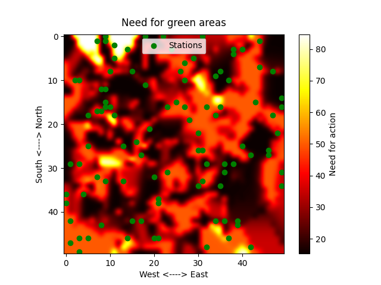
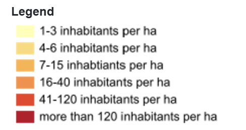
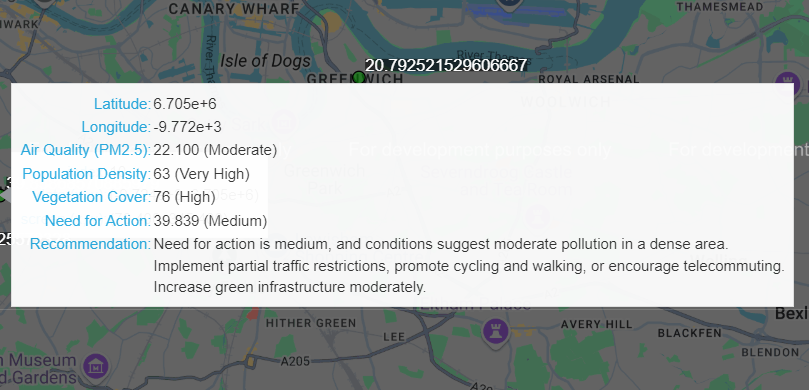
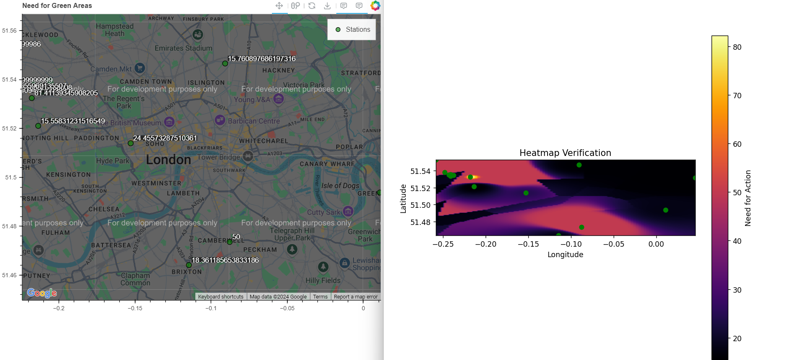

# Fuzzy Sets & Systems – Group Project Report: BettAir

## Introduction

According to the ‘world health organization’ (WHO) air pollution is one of the leading environmental risk factors for disease. BettAir is an advanced fuzzy recommender system designed to enhance urban air quality management by integrating data from air quality sensors with additional information such as population density. The system generates a comprehensive heatmap that identifies priority areas where urban planners should focus their efforts to improve air quality. 

*“Reliable estimates of exposure to air pollutants and related impacts on health are key to  better inform policy-makers, as well as other health and development partners.”* ([1], p.19) 

By analyzing various factors, BettAir provides tailored recommendations based on the specific conditions of each area. For instance, in densely populated regions with limited green spaces, the system may prioritize the creation of parks and vegetation to enhance air quality. Conversely, in areas located near major roads, BettAir might suggest implementing measures to reduce traffic-related emissions, such as optimizing traffic flow or promoting the use of public transportation.

This adaptive approach ensures that interventions are both targeted and effective, addressing the unique air quality challenges of different urban environments. By leveraging real-time sensor data and contextual information, BettAir supports informed decision-making, ultimately contributing to healthier and more sustainable cities.


## The System

### Heat map
The main output of BettAir is a heatmap that can be used as a layer in GIS-applications (Geographic Information Systems). The heatmap includes the “Stations”, where it takes its input data from, and the output values as a continuous colormap.

In our implementation, each Station holds data for all three input variables; 
- Air pollution (pm2.5 - µg/m³)
- Population density (inhabitants/m2)
- Vegetation cover (%)

Based on the stations placed on the map, we use *barycentric interpolation* of the data (based on the three closest stations) to make a continuous representation of the data. To efficiently identify nearby stations, we store them in a *k-d tree* structure.

The output variable of our fuzzy system is called need_for_action (%), which is mapped to a color-scale to create the heat map. When the need_for_action is calculated throughout the entire map, we get a figure looking something like this:



The idea is that this can provide a layer that can be plotted on top of a real world map, indicating what parts of a city that are in need of attention when it comes to green areas.

### Membership functions

#### Before interview:
For our initial membership functions, we made an “educated guess”  (e.g. Wikipedia) on what was considered high and low values for the different inputs, with triangles and trapezoids as shapes (using scikit-fuzzy’s functions `.trimf()` and `.trapmf()`).

Click [here](./images/membership_functions/before_evaluation) for plots of our early membership functions.

#### After interview:

During the interview, we got some good tips on how we could improve our membership functions. For example, the membership function for population density is now adapted to the scale used in the Swiss Confederation’s official GIS [2]:



We also changed the shape of our membership functions to gaussian curves, to reduce the effect of threshold values (e.g. population going from 6 to 7 inhabitants per ha, drastically changing the output). With smoother membership functions, the system also outputs a heatmap with smoother edges.

You can find our updated membership functions [here](./images/membership_functions/after_evaluation).

### Rules

BettAir’s fuzzy rules constitute the core of the software’s logical reasoning with the input data. As the city planner approved them as a reasonable way to determine the need for green areas, they remained almost unchanged after the evaluation interview: 

#### Rule 1
```
IF air pollution is ‘unhealthy’ AND population density is (‘high’ OR ‘very high’ OR ‘highest’)
THEN need for action is ‘high’
```
#### Rule 2
```
IF air pollution is ‘unhealthy’ AND population density is (‘low’ OR ‘medium’) 
THEN need for action is ‘medium’
```
#### Rule 3
```
IF air pollution is ‘unhealthy’ AND population density is ‘very low’ 
THEN need for action is ‘low’
```
#### Rule 4
```
IF air pollution is ‘moderate’ 
THEN need for action is ‘medium’
```
#### Rule 5
```
IF air pollution is ‘clean’ 
THEN need for action is ‘low’
```
#### Rule 6
```
IF vegetation cover is ‘high’ 
THEN need for action is ‘low’
```
As the only post-evaluation change, Rule 1 had to be updated to handle the new term ‘highest’, as our new scale for air_pollution required six terms instead of our early implementation with only five.

### OpenAQ
Our system retrieves near real-time air quality data using the OpenAQ API, which provides a dynamic, up-to-date dataset. The OpenAQ API is freely accessible at [openaq.org](https://openaq.org). To obtain the latest readings from a given sensor, we use the endpoint:

*https://api.openaq.org/v3/locations/{location_id}/latest*

By parsing the JSON response, we extract the most relevant metrics—including PM2.5 concentration—along with the sensor’s geographic coordinates. These coordinates are then utilized to plot the sensor on our map and to feed the interpolation process for our heatmap, ultimately providing a more accurate and responsive visualization of current air quality conditions.

### Bokeh

For data visualization, we use Bokeh, a Python library capable of generating interactive visualizations. With Bokeh’s GMapPlot (Google Map integration), we can overlay sensor locations on top of a map, enabling users to easily hover over each station to view detailed information. The interactive features allow users to observe the fuzzy membership scores and understand the recommendations for actions related to the air quality data. As a result, Bokeh enhances both the intuitiveness and the user-friendliness of our system’s visualizations.




### Interface:

 

### Evaluation:
To assess the effectiveness and real-world applicability of our system, we conducted an interview with a professional from the city planning office in Bern. This discussion provided valuable insights into potential improvements and affirmed the system’s practical relevance. 

The interviewee responded positively to the concept of visualizing air quality data through maps rather than relying solely on point measurements. This map-based visualization aims to make air quality information more intuitive and accessible to the general public, who may lack specialized knowledge in this area. Although city planners are already adept at interpreting such data, the participant emphasized that intuitive visualizations could significantly aid in communicating project plans to residents. By clearly illustrating why and how projects are designed, the system can enhance public understanding and facilitate greater community involvement in urban planning processes.

Furthermore, the interview revealed additional factors that could enhance our system’s accuracy and utility. For instance, incorporating measurements related to the proximity of major motorways and nearby industrial sources of pollution could provide a more comprehensive picture of air quality issues. 

The city planner also pointed us toward valuable data sources for these additional measurements, which had not been initially apparent to our team. Integrating these factors and data sources would allow our system to offer more detailed and actionable insights, thereby improving its overall effectiveness in monitoring and managing urban air quality.


For a summary of our interview, please refer to the [Interview Report](./interview_report.md).

### Discussion
We have developed a system that enhances the accessibility of a city’s air quality data for its residents by integrating real-time dynamic sensor data with a fuzzy rules-based framework to assess the severity of air quality issues. This approach is highly scalable, performing more effectively as additional sensors are deployed, which allows for a more detailed and accurate mapping of air quality distribution throughout the area.

Advancements in sensor technology further support the feasibility of our system, enabling implementation at a relatively low cost. With individual sensors available for approximately 50 CHF, cities can adopt this solution to gain valuable insights into air quality with minimal operational expenses.

Moreover, this system allows for the possibility of directly involving citizens by enabling them to link their personally owned sensors to the network. This crowdsourcing approach not only increases the density and reach of the sensor network but also fosters community engagement, empowering individuals to actively contribute to environmental monitoring and awareness.

This affordability and participatory model ensure municipalities can improve public awareness and response to air quality concerns without significant financial burdens, thereby providing substantial value through enhanced environmental monitoring.

### Project limitations
The current system leverages open-source data to provide moderately real-time insights into air quality. However, accurately quantifying nearby green spaces remains a major challenge. Currently, we rely on manually inputting estimates derived from GIS maps to approximate the amount of vegetation around each sensor. This manual approach limits our system’s accuracy and overall effectiveness.

To address this issue, one potential improvement involves integrating additional monitoring stations specifically located in parks and other green areas. Increasing the number and coverage of these stations could help refine our vegetation data and enhance the reliability of our interpolations.

Our interviews also underscored that urban air quality is influenced by numerous factors beyond simply increasing greenery or reducing traffic. Variables such as proximity to major roads, the presence of polluting industries, and many others play critical roles. Incorporating more of these variables would significantly deepen our analysis, although this would extend beyond the current scope of the project.

In addition, the usability of the system could be improved by refining the user interface. While UI design was not the primary focus of this course, creating a more intuitive and visually appealing interface would help broaden the system’s adoption among both urban planners and the general public.

Finally, a current technical limitation is our inability to overlay the heatmap directly onto the map. Instead, we must present these views in separate windows. A future iteration of the system should integrate the heatmap as a true overlay for a more seamless and coherent user experience.

### References:
1. Ambient Air Pollution: A Global Assessment of Exposure and Burden of Disease, WHO, 2016 Available at: 2. http://apps.who.int/iris/bitstream/10665/250141/1/9789241511353-eng.pdf
Accessed: 06/12-2024
2. [Maps of Switzerland - Swiss Confederation - map.geo.admin.ch](https://map.geo.admin.ch/#/map?lang=en&center=2660000,1190000&z=1&bgLayer=ch.swisstopo.pixelkarte-farbe&topic=ech&layers=ch.bfs.volkszaehlung-bevoelkerungsstatistik_einwohner@year=2023), last checked at 02/12-2024
3. https://openaq.org/ Accessed 06/12-2024

